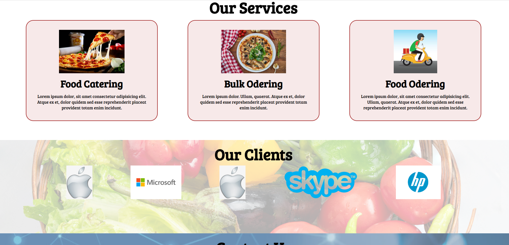

# 🍴 MyOnlineMeal Website  

## 📌 Project Overview  
*MyOnlineMeal* is a simple and responsive static website built using **HTML** and **CSS**.  
It is a beginner-friendly demo of a food ordering website that includes navigation, sections, forms, and various styling techniques.  

## ✨ Features  
- 📍 **Navigation bar** with structured header and footer  
- 🔗 Links using `<ul>`, `<li>`, and `<a>` tags  
- 📝 Headings (`<h1>`, `<h2>`) and paragraph content  
- 🖼️ Images with `` tag  
- 🔘 Button elements for interactions  
- 📩 **Form** with input fields and `textarea` for user feedback/order form  
- 🔠 Google Fonts for improved typography  

## 🎨 Styling with CSS  
- **Flexbox** for responsive layout  
- **Margin & Padding** for spacing and alignment  
- **Align-items & Justify-content** for flexbox positioning  
- **Font-size, Text-align, Font-family** (Google Fonts)  
- **Custom utility classes** like `.h-primary`, `.h-secondary`  
- **Borders, Border-radius, Background colors** for UI elements  
- **Height & Width** for layout design  
- **Position & Z-index** for element stacking and placement  
- **Opacity** for visual effects  
- **Flex-direction** for flexible layouts  

## 🛠️ Tech Stack  
- **HTML5**  
- **CSS3**  

## 📷 Preview  
**Home**
 

**Our Services & Our Clients**
  

## 🚀 How to Use  
1. Clone or download the repository  
2. Open the project folder  
3. Launch the `index.html` file in your browser to view the website  

---
